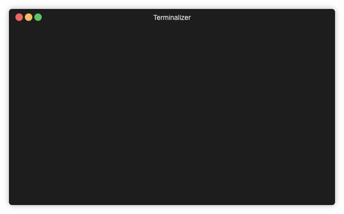

# zsh-zkubectl
> completions to zkubectl



## Installation with [antigen](https://github.com/zsh-users/antigen)

Add to your .zshrc

```sh
antigen bundle alexrochas/zsh-zkubectl
```

## Completions

* Autocomplete `kubectl login` using [fuzzy-finder](https://github.com/junegunn/fzf).

## FIX-ME

I managed to make it work only when adding `compinit` explicitly to the end of `.zshrc` file.

## Meta

Alex Rocha - [about.me](http://about.me/alex.rochas)
